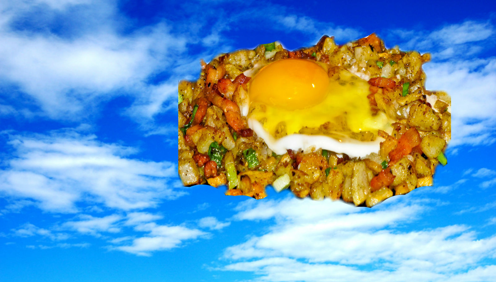

!SLIDE subsection

#the great hash in the sky

!SLIDE bullets

"I've long treated the database as mainly being a big hash."
- DHH

!SLIDE image center

All hail the great hash in the sky!

!SLIDE

 *: Forgive me, I'm only going to talk about relational databases.

!SLIDE bullets

# purpose
* Store data reliably & efficiently.
* Query data flexibly & performantly.

!SLIDE subsection

#how does it work?

!SLIDE

  
parser

  
optimizer

  
executor

  
storage

<i>(Modestly simplified for your thinking pleasure.)</i>
 
See <a href="http://www.postgresql.org/docs/9.1/static/overview.html">PostgreSQL Manual, Ch 44.</a>

!SLIDE

  
PARSER

  
optimizer

  
executor

  
storage

<b>input</b>: SQL strings 

<b>output</b>: parse tree 

 

Responsibility includes syntax checking, error messages.

!SLIDE

  
parser

  
OPTIMIZER

  
executor

  
storage

<b>input</b>: parse tree

<b>output</b>: query plan

 

Cost-based optimizer uses data statistics and available indices to find fastest query execution path.

!SLIDE

  
parser

  
optimizer

  
EXECUTOR

  
storage

<b>input</b>: query plan

<b>output</b>: result set

 

Converts the query plan into execution nodes, retrieves results by recursively evaluating the execution nodes.

!SLIDE

  
parser

  
optimizer

  
executor

  
STORAGE

<b>input</b>: data

<b>output</b>: tuples

 

Responsible for keeping track of data, statistics, and caching. Also, responsible for not losing stuff.

