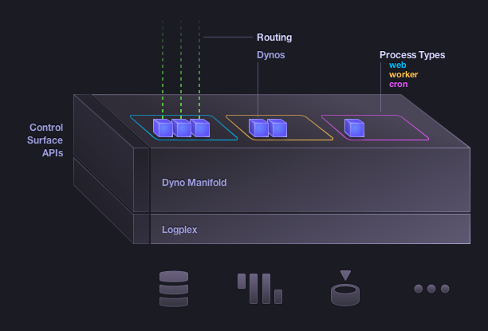

!SLIDE subsection

# Why are you you doing this?

!SLIDE

introducing...

!SLIDE

# Heroku

!SLIDE bullets incremental
# What's a Heroku? #

* "Platform"-as-a-service
* Focus: Developer Productivity
* An alternative to running servers
* Stateless runtime
* Simple deployment

!SLIDE bullets

# Supported Languages
* Ruby
* Python
* Java / Clojure / Scala
* Node.js
* [Logo](http://cranes.heroku.com/)

!SLIDE center
# How Heroku Works

!SLIDE

# Hold on, hold on.

!SLIDE

# Did you say stateless?

!SLIDE center

## Where's the [data], Lebowski?

!SLIDE center

## It's, uh, down there somewhere.
## Let me take another look.

!SLIDE

# Enter...

!SLIDE

!SLIDE bullets incremental
# [Heroku Postgres](http://postgres.heroku.com) #

* Database service
* Most PostgreSQL databases in the world
* Now available to non-Heroku users,
* >4 years of production deployment.

