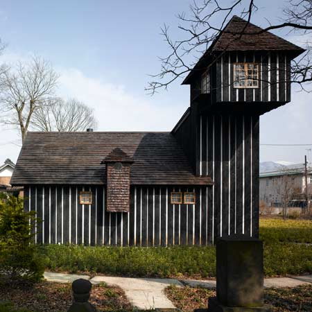
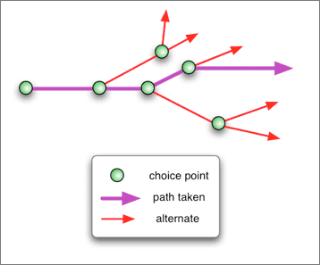
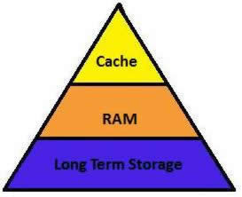

!SLIDE subsection

# What are you doing?

!SLIDE

## Providing Postgres databases that work

!SLIDE

# Not possible!*

!SLIDE

## *: In the general case.

!SLIDE
.notes We are focusing on a particular segment: web applications.

# Specific use case
## OLTP up to 1TB per node
## aka: most web apps without a stock symbol

!SLIDE bullets incremental

# What this means for us

* productivity
* reliability

!SLIDE bullets incremental

# What we don't do

* help you with your schema
* optimize your queries
* ship patched Postgres

!SLIDE center
.notes If setting up your own server is like building a house,

## Roll your own

!SLIDE center
.notes Heroku Postgres is like a luxury condominium.

## Managed

!SLIDE bullets incremental

# Productivity

* immediate availability
* friendlier tools
* timeline oriented

!SLIDE bullets incremental

# Immediate Availability

* get a database now
* begin developing immediately
* or, go to production today
* sometimes by accident

!SLIDE subsection

# Friendlier tools

!SLIDE code commandline incremental

# Take a backup...

    $ heroku pgbackups:capture CHARCOAL

    HEROKU_POSTGRESQL_CHARCOAL  ----backup--->  b001

    Capturing... done
    Storing... done

!SLIDE code commandline incremental

# ... or daily backups...

    $ heroku addons:upgrade pgbackups:daily
    -----> Upgrading pgbackups:daily to myapp... done
           Plan upgraded

!SLIDE code commandline incremental

# and restore a backup.

    $ heroku pgbackups:restore CHARCOAL --confirm myapp

    CHARCOAL  <---restore---  b001 (most recent)
                              HEROKU_POSTGRESQL_CHARCOAL
                              2011/10/19 06:37.31
                              1.2GB

    Retrieving... done
    Restoring... done

!SLIDE subsection

# Timeline Oriented

!SLIDE center

# Traditional database

!SLIDE center

# Timeline-oriented thinking

!SLIDE

## A server is nothing but a place
## your timeline is right now.

!SLIDE code commandline incremental
## Timelines can have multiple travellers

    $ heroku addons:add heroku-postgresql --follow CHARCOAL
    -----> Adding heroku-postgresql to myapp... done
           Attached as HEROKU_POSTGRESQL_WHITE
           Follower will become available for read-only queries

!SLIDE code commandline incremental
## Timelines can have branches

    $ heroku addons:add heroku-postgresql --fork CHARCOAL
    -----> Adding heroku-postgresql to myapp... done
           Forked as HEROKU_POSTGRESQL_WHITE
           Database available after completing forking

!SLIDE code commandline incremental
## Timelines can be short-lived

    $ heroku addons:remove HEROKU_POSTGRESQL_WHITE
    -----> Removing HEROKU_POSTGRESQL_WHITE from myapp... done

!SLIDE bullets incremental

# New primitives, old problems

* Test ideas by forking your database
* Run analytics on followers
* Load test on a larger host

!SLIDE subsection

# Reliability

!SLIDE

## Durability is always relative to event severity

!SLIDE center
.notes Durability guarantees move up and down this stack. Power outage negates RAM, hardware failures negate long term storage.
# Memory Hierarchy

!SLIDE center
.notes We consider replicated off-site storage part of this hierarchy, and ship all WAL logs there.

## /__ Remote Storage __\

!SLIDE
.notes We use the same technology for our productivity features as for our durability.
## (durability ==> timelines)

!SLIDE bullets incremental

# Outages Happen
* Postgres Crashes
* Hardware failures
* Network outages
* Disk problems

!SLIDE center

## I've seen everything

!SLIDE

## Average recovery time from hardware failure:
# ~12m
